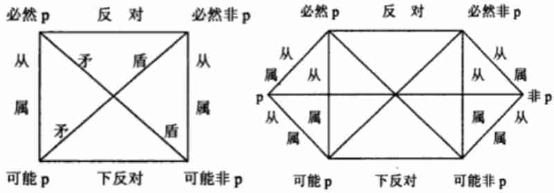

# 模态命题

模态命题主要是反映事物情况存在或发展的必然性或可能性的命题。

模态命题包括“必然”或“可能”等模态词。包含“必然”的命题称必然命题，包含“可能”的命题称可能命题。

例如：  
经济过热必然导致通货膨胀。 ← 必然肯定命题，一般公式是“必然ｐ”  
张三必然考不上大学。 ← 必然否定命题，一般公式是“必然非ｐ”  
他可能对我有看法。 ← 可能肯定命题，一般公式是“可能ｐ”  
强盗的儿子可能不是强盗。 ← 可能否定命题，一般公式是“可能非ｐ”

“必然ｐ”与“可能非ｐ”之间、“必然非ｐ”与“可能ｐ”之间具有 **矛盾关系**，“必然ｐ”与“必然非ｐ”之间具有 **反对关系**，“可能ｐ”与“可能非ｐ”之间具有 **下反对关系**，“必然ｐ”与“可能ｐ”之间、“必然非ｐ”与“可能非ｐ”之间具有 **从属关系**。

上述关系可以用一个正方图形来表示，该正方图形被称为模态方阵。如果再考虑实然命题，模态方阵可以拓展为模态六角阵图。

