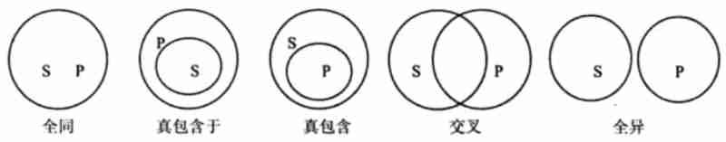

# 直言命题的推理

## 1 - 利用概念间的关系进行推理

### 1.1 - 概念外延间的关系

两个概念之间在外延（一个概念的外延是指这个概念所反映的事物范围）上主要存在着五种关系，即：**全同关系**、**真包含于关系**、**真包含关系**、**交叉关系** 与 **全异关系**。

- **全同关系**，也叫同一关系，它是指两个概念的外延完全相重合，例如，“珠穆朗玛峰”与“世界上的最高峰”这两个概念之间就具有全同关系。
- **真包含于关系** 是指一个概念的全部外延与另一个概念的部分外延相重合，例如，“学生”与“人”这两个概念之间就具有真包含于关系。
- **真包含关系** 是指一个概念的部分外延与另一个概念的全部外延相重合，例如，“学生”与“大学生”这两个概念之间就具有真包含关系。
- **交叉关系** 是指一个概念的部分外延与另一个概念的部分外延相重合，例如，“女青年”与“运动员”这两个概念之间就具有交叉关系。
- **全异关系** 是指两个概念之间在外延上没有任何重合部分，例如，“大学生”与“中学生”这两个概念之间就具有全异关系。

如果用 S、P 分别表示两个概念，用圆圈表示概念的外延，那么上述概念间的五种外延关系，可分别用欧拉图（一种用圆圈来表示的概念之间在外延上的关系的图解）具体表示，如下图：



### 1.2 - 直言命题的真假特征

直言命题的主项和谓项在外延上所存在的五种关系，决定了一个具体的直言命题的真假特征。其中，**全称肯定命题** 在主项和谓项之间具有全同关系或真包含于关系时为真，在其他关系时为假；**全称否定命题** 在主项和谓项之间具有全异关系时为真，在其他关系时为假；**特称肯定命题** 在主项和谓项之间具有全异关系时为假，在其他关系时为真；**特称否定命题** 在主项和谓项之间具有全同关系或真包含于关系时为假，在其他关系时为真；

```
┏━━━━━━━━━━━━━━━━━━━━━━━━━━━━━━━━━━━━━━━━━
╏ 　关系 ╎ 全同 ╎ 真包含 ╎ 真包含 ╎ 交叉 ╎ 全异
╏ 判断　 ╎ 关系 ╎ 于关系 ╎ 关系　 ╎ 关系 ╎ 关系
╏ ーーー ╎ ーー ╎ ーーー ╎ ーーー ╎ ーー ╎ ーー
╏ ＳＡＰ ╎ 　真 ╎ 　真　 ╎ 　假　 ╎ 　假 ╎ 　假
╏ ＳＥＰ ╎ 　假 ╎ 　假　 ╎ 　假　 ╎ 　假 ╎ 　真
╏ ＳＩＰ ╎ 　真 ╎ 　真　 ╎ 　真　 ╎ 　真 ╎ 　假
╏ ＳＯＰ ╎ 　假 ╎ 　假　 ╎ 　真　 ╎ 　真 ╎ 　真
┗━━━━━━━━━━━━━━━━━━━━━━━━━━━━━━━━━━━━━━━━━
```

## 2 - 词项的周延性

词项就是指直言命题的主项和谓项。**词项的周延性** 就是指直言命题的主项或谓项的外延（即作为词项的概念所反映的事物对象的范围）的断定情况。在一个直言命题中，如果断定了主项或谓项的全部外延，就说主项或谓项是周延的；如果没有断定主项或谓项的全部外延，就说主项或谓项是不周延的。

〓周延性的判断方法〓

词项的周延性是由词项常量（直言命题的联项和量项）来决定的。具体来说，**主项的周延性由量项来决定，量项是全称的则主项周延，量项是特称的则主项不周延**。**谓项的周延性由联项来决定，联项是否定的则谓项周延，联项是肯定的则谓项不周延**。当我们说“S 是 P”的时候，不需要断定“S 是所有的 P”，但当我们说“S 不是 P”的时候，已经断定了“S 不是所有的 P”。

词项周延项与否的判别规则：

- 全称或单称的主项都周延
- 特称的主项都不周延
- 肯定的谓项都不周延
- 否定的谓项都周延

例如：  
所有学生都是爱国的。← 主项“学生”是周延的，但谓项“爱国的”是不周延的  
所有卖国贼都不是爱国者。← 主项“卖国贼”和谓项“爱国者”都是周延的  
有些劳模是冒牌的。← 主项“劳模”和谓项“冒牌的”都是不周延的  
有些领导人不是勤政爱民的。← 主项“领导人”是不周延的，但谓项“勤政爱民的”是周延的

## 3 - 直言命题的变形推理

直言命题的变形推理就是通过改变前提中直言命题的形式，即通过改变前提中直言命题的联项或主项与谓项的位置，从而推出结论的推理。它包括 **换质推理**、**换位推理** 以及二者的综合运用。

### 3.1 - 换质推理

换质推理是通过改变前提中直言命题的联项，即将“是”改为“不是”或将“不是”改为“是”，从而推出结论的推理。换质推理通常又称“换一个说法”，即肯定的命题用否定的方式来表达，或者否定的命题用肯定的方式来表达。

在进行换质推理时需要注意的是，除了需要改变联项外，同时还需要把结论中的谓项变为前提谓项的矛盾概念。直言命题 A、E、I、O 的换质推理情况如下：  
“所有 S 是 P”可以换质为“所有 S 不是非 P”，  
“所有 S 不是 P”可以换质为“所有 S 是非 P”，  
“有些 S 是 P”可以换质为“有些 S 不是非 P”，  
“有些 S 不是 P”可以换质为“有些 S 是非 P”。

例如：  
“所有商品都是有价值的”可以换质为“所有商品都不是没有价值的”。  
“所有人都不是长生不老的”可以换质为“所有人都是有死的”。  
“有些人是自私的”可以换质为“有些人不是不自私的”。  
“有些领导人不是廉洁的”可以换质为“有些领导人是不廉洁的”。

注意：换质推理得到的命题与原命题等值。

### 3.2 - 换位推理

换位推理是通过改变前提中直言命题的主项和谓项的位置，从而推出结论的推理。换位推理通常又称为“倒过来说”。

在进行换位推理时，除了需要交换主项和谓项的位置外，还需要注意在前提中不周延的词项在结论中也不能周延。直言命题 A、E、I、O 的换位推理情况如下：  
“所有 S 是 P”可以换位为“有些 P 是 S”，  
“所有 S 不是 P”可以换位为“所有 P 不是 S”，  
“有些 S 是 P”可以换位为“有些 P 是 S”，  
“有些 S 不是 P”不能换位为“有些 P 不是 S”。

例如：  
“所有无价证券都是不准买卖的物品”可以换位为“有些不准买卖的物品是无价证券”。  
“所有大学生不是中学生”可以换位为“所有中学生不是大学生”。  
“有些花是红色的”可以换位为“有些红色的是花”。  
“有些人不是大学生”不能换位为“有些大学生不是人”。

需要指出的是，全称肯定命题“所有 S 是 P”，通过换位只能推出一个特称肯定命题“有些 P 是 S”，不能推出“所有 P 是 S”，因为“P”在前提中是全称肯定命题的谓项，是不周延的，如果推出“所有 P 是 S”，“P”作为全称命题的主项就是周延的了，违背了“在前提中不周延的词项在结论中也不能周延”的要求。例如，我们从“所有无价证券都是不准买卖的物品”出发，通过换位只能得到“有些不准买卖的物品是无价证券”，不能得到“所有不准买卖的物品都是无价证券”，显然，像毒品、人等都是“不准买卖的物品”，但并非“无价证券。

另外，特称否定命题“有些 S 不是 P”不能通过换位推出“有些 P 不是 S”，因为“S”在前提中作为特称命题的主项不周延，如果换位后作为结论的谓项就是周延的了，违背了“在前提中不周延的词项在结论中不能周延”的要求。

### 3.3 - 换质推理和换位推理的总结

直言命题的换质推理和换位推理：

```
┏━━━━━━━━━━━━━━━━━━━━━━━━━━━━━━━━━━━━━━━━━━━━━━━━━
╏ 　　　　　　　 换质推理　　　　　　 换位推理
╏ 所有Ｓ不是非Ｐ　　↔　　 所有Ｓ是Ｐ　　　→　　有些Ｐ是Ｓ
╏ 所有Ｓ是非Ｐ　　　↔　　 所有Ｓ不是Ｐ　　→　　所有Ｐ不是Ｓ
╏ 有些Ｓ不是非Ｐ　　↔　　 有些Ｓ是Ｐ　　　→　　有些Ｐ是Ｓ
╏ 有些Ｓ是非Ｐ　　　↔　　 有些Ｓ不是Ｐ　　→　　换位无效
┗━━━━━━━━━━━━━━━━━━━━━━━━━━━━━━━━━━━━━━━━━━━━━━━━━
上图中两个直言命题的换位推理较为特殊，需要大家记住。
分别是：“所有Ｓ是Ｐ”通过换位只能推出“有些Ｐ是Ｓ”，
而“有些Ｓ不是Ｐ”不能进行换位推理。
```

## 4 - 三段论

### 4.1 - 三段论的结构分析

三段论是由包含着一个共同词项的两个直言命题推出一个新的直言命题的推理。

例如：  
所有阔叶植物都是落叶的。  
所有葡萄树都是阔叶植物。  
所以，所有葡萄树都是落叶的。

三段论在结构上包括 **大项**、**小项** 和 **中项**。大项是作为结论的谓项的概念。小项是作为结论的主项的概念。中项是在前提中出现两次而在结论中不出现的概念。上例中，“落叶的”是大项，“葡萄树”是小项，“阔叶植物”是中项。

三段论的两个前提分别叫做 **大前提** 和 **小前提**。其中，包含大项的前提叫大前提，包含小项的前提叫小前提。中项在三段论中非常重要，它起到把大小前提连接起来，从而推出结论的桥梁和纽带作用。

在三段论中，大项通常用字母 P 表示，小项用字母 S 表示，中项用字母 M 表示。这样，上述推理的一般公式可以表示为：

```
┏━━━━━━━━━━━━━━━━
╏ 所有Ｍ都是Ｐ
╏ 所有Ｓ都是Ｍ
╏ ーーーーーーーーー
╏ 所以，所有Ｓ都是Ｐ
┗━━━━━━━━━━━━━━━━
也可以写为：
┏━━━━━━
╏ ＭＡＰ
╏ ＳＡＭ
╏ ーーー
╏ ＳＡＰ
┗━━━━━━
```

上述公式只是三段论最为重要的公式之一。它属于三段论第一格的 AAA 式。三段论共有四个不同的格。

三段论的格就是根据中项在三段论中的不同位置所构成的不同形式的三段论。在三段论的第一格中，中项是大前提的主项、小前提的谓项；在第二格中，中项是大、小前提的谓项；在第三格中，中项是大、小前提的主项；在第四格中，中项是大前提的谓项、小前提的主项。三段论的四个格可以分别表示如下：

```
  第一格    第二格    第三格    第四格
┏━━━━━━━ ┏━━━━━━  ┏━━━━━━  ┏━━━━━━
╏ ＭーＰ  ╏ ＰーＭ  ╏ ＭーＰ  ╏ ＰーＭ
╏ 　╲　　 ╏ 　　　  ╏ 　　　  ╏ 　╱
╏ ＳーＭ  ╏ ＳーＭ  ╏ ＭーＳ  ╏ ＭーＳ
╏ ーーー  ╏ ーーー  ╏ ーーー  ╏ ーーー
╏ ＳーＰ  ╏ ＳーＰ  ╏ ＳーＰ  ╏ ＳーＰ
┗━━━━━━━ ┗━━━━━━  ┗━━━━━━  ┗━━━━━━
```

例如：  
所有黄铜不是金子。  
所有黄铜是闪光的。  
所以，有些闪光的不是金子。

上例就是一个第三格的三段论。

针对每一个格的三段论，如果在考虑前提和结论的联项和量项的不同，就可以得到某一个格的三段论的具体公式。如上例中三段论的公式就是第三格的 EAO 式，因为它的大前提是 MEP，小前提是 MAS，结论是 SOP。

### 4.2 - 三段论的一般判定规则

一个三段论是否正确，可以通过下述规则来加以判定。

❶ 一个正确的三段论有且只能有三个不同的词项

三段论的实质就是要借助前提中一个共同词项即中项作为媒介，使大、小项发生逻辑关系从而推出结论的。如果一个三段论只有两个不同的项，那么大、小项就找不到这样一个中项来建立关系从而推出结论。如果一个三段论包含有四个不同的词项，那么就有可能大项和一个项存在关系，小项和另一个项存在关系，但找不到一个项分别和大、小项存在关系。至于如果包括五个或六个不同的项，那就更不是三段论了。违反这条规则，通常出现的逻辑错误称为“四项词”或“四概念”。

例如：

```
鲁迅的小说不是一天能够读完的
《故乡》是鲁迅的小说
ーーーーーーーーーーーーーー
《故乡》不是一天能够读完的
```

上述推理显然是错误的。例子中“鲁迅的小说”虽然是同一个词语，但是所表达的概念却不一样。它在大前提中表达的是“集合概念”（整体概念），在小前提中表达的却是“非集合概念”（非整体的类概念）。二者是全异关系。所以，整个推理犯了“四项词”的逻辑错误。

❷ 在一个正确的三段论中，中项至少要周延一次

中项要起到媒介作用，必须至少有一部分外延既与大项建立关系，又与小项建立关系。如果中项两次都不周延，那么中项就有可能不存在一部分外延既和大项联系，又和小项联系，这就无法确定大、小项的关系。如果中项至少周延一次，那么，中项的全部外延就与大项或小项建立了联系，这样就能确保至少有一部分外延同大、小项存在关系。违反这条规则，就要犯“中项两次不周延”的逻辑错误。

例如：

```
英雄难过美人关
我难过美人关
ーーーーーーー
我是英雄
```

上例中的中项“难过美人关”，在前提中两次都是肯定命题的谓项，都不周延，犯了“中项两次不周延”的逻辑错误。

❸ 在前提中不周延的词项在结论中也不能周延

这条规则是对大项和小项的外延的规定。三段论是一种必然性的推理，它要求，不能从部分推出全部，不能从不周延的词项过渡到周延的词项，否则推理就不具有必然性了。违反这条规则所犯的逻辑错误有“大项不当周延”和“小项不当周延”。

“大项不当周延”是指大项在前提中不周延，而在结论中变得周延了。例如：

```
共产党员都应该为抗非典捐款
我不是共产党员
ーーーーーーーーーーーーー
我不应该为抗非典捐款
```

上例中的大项“应该为抗非典捐款”在前提中是肯定命题的谓项，不周延；但在结论中却是否定命题的谓项，周延了，所以，犯了“大项不当周延”的错误。

“小项不当周延”是指小项在前提中不周延，而在结论中变得周延了。例如：

```
小王不讲卫生
小王是研究生
ーーーーーーー
研究生不讲卫生
```

上例中的小项“研究生”在前提中是肯定命题的谓项，不周延，但在结论中是全称命题的主项，周延了，所以，犯了“小项不当周延”的逻辑错误。

❹ 两个否定前提推不出结论

如果三段论的两个前提都是否定的，那么小项和大项必然都同中项相排斥，这样，中项就无法起到联结大、小项的作用，做不出形式有效的推到。例如：

```
中学生不是大学生
这些学生不是中学生
ーーーーーーーーー
这些学生？
```

上例不能推出必然性的结论，因为，如果推出“这些学生是大学生”，但也有可能这些学生刚好是小学生呢，小学生显然也不是中学生；如果推出“这些学生不是大学生”，但也有可能这些学生刚好是大学生呢，大学生显然也不是中学生。

❺ 如果前提中有一个是否定的，那么结论就是否定的；如果结论是否定的，那么前提中必有一个是否定的

如果前提中有一个是否定的，那么小项和大项之一必然同中项相排斥，无论是小项同中项相排斥，还是大项同中项相排斥，在结论中小项同大项必然相排斥，结论必然是否定的。反过来，如果结论是否定的，那么大项同小项互相排斥，因此，在前提中大项和小项之一必然同中项相排斥，前提中必然有一个是否定的。

例如：

```
凡有效的经济合同必须采取书面形式
这份经济合同没有采取书面形式
ーーーーーーーーーーーーーーーー
这份经济合同不是有效的
```

❻ 两个特称前提推不出结论

两个前提都是特称的，则前提的组合情况无非三种：OO、II、IO(OI)。  
（1）OO。根据规则 ❹ “两个否定前提推不出结论”，推不出结论。  
（2）II。其中没有一个词项是周延的，根据规则 ❷，犯有“中项两次不周延”的错误，推不出正确的结论。  
（3）IO(OI)。其中只有一个词项是周延的，首先这个唯一周延的词项要保证符合规则 ❷ “中项至少要周延一次” 的要求，必须作为中项，因而大项在前提中不周延。但是，根据规则 ❺，结论必然是否定的，所以，大项在结论中是周延的，这就违反规则 ❸，犯了“大项不当周延”的逻辑错误。如果要保证符合规则 ❸ 的要求，大项在前提中和结论中都周延，就会违反规则 ❷，犯了“中项两次不周延”的逻辑错误。因此，根据规则 ❷ 和规则 ❸，IO(OI) 作前提也推不出结论。

❼ 如果前提中有一个是特称的，那么结论就是特称的

根据规则 ❻，如果两个前提中有一个是特称的，则另一个必须是全称的。因此，包含一个特称命题的两个前提无非以下四种情况：AI、AO、EI、EO。  
（1）EO。根据规则 ❹，推不出正确的结论。  
（2）AI。其中只有一个周延的词项，即 A 命题的主项。根据规则 ❷，前提中这个唯一周延的词项必须作中项，否则就要犯“中项两次不周延”的错误。这样，大、小项在前提中均不周延。根据规则 ❸，大、小项在结论中也不得周延。所以，结论必然是特称的。  
（3）AO、EI。其中都分别有两个词项周延。根据规则 ❷，其中一个周延的词项必须作中项，否则就会犯“中项两次不周延”的逻辑错误。有根据规则 ❺，结论必然是否定的，所以，大项在结论中是周延的。根据规则 ❸，大项在前提中必须周延，否则就会犯“大项不当周延”的逻辑错误。因此，另一个周延的词项必须作大项，小项在前提中不周延。根据规则 ❸，则小项在结论中也不得周延，所以结论必然是特称的。  
综上所述，前提中有一个是特称的，则结论就是特称的。

〓总结〓

记住下面几句话将有助于把握上述七条规则：**中有周延词项三，大项小项不扩展，一特得特否得否，否特成双结论难**。

第一句话说的其实就是三段论的规则 ❷ 和规则 ❶。“中有周延”即中项必须至少周延一次。第二句话说的就是规则 ❸。在前提中不周延的词项在结论中也不能周延。第三句话说的是规则 ❼ 和规则 ❺。“一特得特”即前提中有一个是特称的，则结论必然是特称的；“否得否”即前提中有一个是否定的，则结论必然是否定的。第四句话说的是规则 ❹ 和规则 ❻。“否成双”即两个否定前提推不出结论；“特成双”即两个特称前提推不出结论。

### 4.3 - 案例分析

【例 1】所有的聪明人都是近视眼，我近视得很厉害，所以，我很聪明。  
以下哪一项揭示了上述推理是明显错误的？  
A. 我是个笨人，因为所有的聪明人都是近视眼，而我的视力那么好。  
B. 所有的猪都有四条腿，但这种动物有八条腿，所以它不是猪。  
C. 小陈十分高兴，所以小陈一定长得很胖；因为高兴的人都长得很胖。  
D. 所有的天才都高度近视，我一定是高度近视，因为我是天才。  
E. 所有的鸡都是尖嘴的，这种总在树上呆着的鸟是尖嘴的，因此它是鸡。

> 解析：  
> 题干是第二格的三段论，该三段论是错误的，犯了“中项两次不周延”的错误。选项 A 也是第二格的三段论，但该三段论是正确的。题干的两个前提和结论都是肯定的，而选项 A 的小前提和结论都是否定的。选项 A 的规范形式可以整理为：“所有的聪明人都近视，我不近视，所以，我不聪明”。选项 B 的规范形式可以整理为：“所有的猪都有四条腿，这种动物没有四条腿，所有这种动物不是猪”，虽然也是第二格的三段论，但其小前提和结论与选项 A 一样都是否定的，也是正确的三段论。选项 C 的规范形式是：“高兴的人都能长胖，小陈十分高兴，所以小陈一定长得胖”，属于第一格的三段论，该三段论是形式有效的。选项 D 的规范形式是：“所有的天才都高度近视，我是天才，所以我一定是高度近视”，该三段论与选项 C 一样，也属于形式有效的第一格三段论。选项 E 的规范形式是：“所有鸡都是尖嘴的，这种鸟是尖嘴的，所有这种鸟是鸡”，与题干一样，是第二格的三段论，也犯了“中项两次不周延”的逻辑错误。所以，正确答案是 E。

【例 2】凡金属都是导电的，铜是导电的，所以铜是金属。  
下面哪项与上述推理结构最相似？  
A. 所有的鸟都是卵生动物，蝙蝠不是卵生动物，所以，蝙蝠不是鸟。  
B. 所有的鸟都是卵生动物，天鹅是鸟，所以天鹅是卵生动物。  
C. 所有从事公共管理工作的都要学习行政管理，老杨是学习行政管理的，所以，老杨是从事公共管理工作的。  
D. 只有精通市场营销理论，才是一个合格的市场营销经理，老张精通市场营销理论，所以，老张一定是合格的市场营销经理。  
E. 华山险于黄山，黄山险于泰山，所以华山险于泰山。

> 解析：  
> 题干是错误的第二格三段论，犯了“中项两次不周延”的逻辑错误。选项 A 虽然也是第二格的三段论，但却是形式有效的三段论，其小前提和结论都是否定命题。选项 B 是第一格的三段论。选项 D 是一个复合命题推理。选项 E 是一个关系推理。选项 C 与题干一样，是错误的第二格三段论，也犯了“中项两次不周延”的逻辑错误。所以，正确答案是 C。

【例 3】有些导演留大胡子，因此，有些留大胡子的人是大嗓门。  
为使上述推理成立，必须补充以下哪项作为前提？  
A. 有些导演是大嗓门。  
B. 所有大嗓门的人都是导演。  
C. 所有导演都是大嗓门。  
D. 有些大嗓门不是导演。  
E. 有些导演不是大嗓门。

> 解析：  
> 题干中的前提是特称的，根据三段论的规则 ❻，另一个前提不能是特称的，否则两个特称前提就不能必然推出结论，因此，另一个前提必须是全称的，这样，选项 A、D、E 都必须排除。如果补充选项 B 作为前提，就会犯“中项两次不周延”的逻辑错误。所以，正确答案是 C。

【例 4】想从事秘书工作的学生，都报考中文专业。李芝报考了中文专业，他一定想从事秘书工作。  
下述哪项如果为真，那么最能支持上述观点？  
A. 所有报考中文专业的考生都想从事秘书工作。  
B. 有些秘书是大学中文专业的毕业生。  
C. 想从事秘书工作的人有些报考了中文专业。  
D. 有不少秘书都有中文专业学位。  
E. 只有中文专业毕业的，才有资格从事秘书工作。

> 解析：  
> 题干是一个第二格的三段论，中项“报考中文专业”在两个前提中都处于肯定命题的谓项，犯了“中项两次不周延”的错误。如果选项 A 为真，就能使前提里的中项“报考中文专业”周延一次，从而使得题干的推理变为形式有效的推理，所以正确答案是 A。选项 B、C、D、E 均不能使中项“报考中文专业”周延一次，故都不是最能支持题干的。

【例 5】所有爱斯基摩土著人都是穿黑衣服的；所有的北婆罗洲土著人都是穿白衣服的；没有既穿白衣服又穿黑衣服的人；H 是穿白衣服的人。  
基于以上事实，下列哪个判断必为真？  
A. H 是北婆罗洲土著人。  
B. H 不是爱斯基摩土著人。  
C. H 不是北婆罗洲土著人。  
D. H 是爱斯基摩土著人。  
E. H 既不是爱斯基摩土著人，也不是北婆罗洲土著人。

> 解析：  
> 本题要求判断 H 的身份，所以，题干中的“H 是穿白衣服的人” 应该是推理的一个前提，该前提如果与“所有的北婆罗洲土著人都是穿白衣服的”构成三段论，则犯了“中项两次不周延”的逻辑错误，因为中项“穿白衣服的人”两次都处于肯定命题的谓项，所以选项 A 和 C 均不成立。进行三段论推理，关键是要找到一个共同的中项把前提联结起来。用“H 是穿白衣服的人”与另一个前提“所有爱斯基摩土著人都是穿黑衣服的”构成三段论，首先需要将其中的一个命题“换一个说法”，例如可以将“H 是穿白衣服的人”换质为“H 不是穿黑衣服的人”，因为题干中有命题“没有既穿白衣服又穿黑衣服的人”，于是可以推出结论：“H 不是爱斯基摩土著人”。所以，正确答案是 B。

【例 6】王晶：李军是优秀运动员，所以，他有资格进入名人俱乐部。张华：不过李军吸烟，他不是年轻人的好榜样，因此李军不应该被名人俱乐部接纳。  
张华的论证使用了以下哪项作为前提？  
Ⅰ. 有些优秀运动员吸烟。  
Ⅱ. 所有吸烟者都不是年轻人的好榜样。  
Ⅲ. 所有被名人俱乐部接纳的都是年轻人的好榜样。  
A. 仅 Ⅰ。  
B. 仅 Ⅱ。  
C. 仅 Ⅲ。  
D. 仅 Ⅱ 和 Ⅲ。  
E. Ⅰ、Ⅱ 和 Ⅲ。

> 解析：  
> 张华的论证中使用了两个三段论。首先，从“李军不是年轻人的好榜样”要推出“李军不应该被名人俱乐部接纳”，还需要增加大前提“所有被名人俱乐部接纳的都是年轻人的好榜样”。这是第一层论证。其次，从“李军吸烟”推出“李军不是年轻人的好榜样”，还需要增加大前提“所有吸烟者都不是年轻人的好榜样”。这是第二层论证。所以，正确答案是 D。

【例 7】在某住宅小区的居民中，大多数中老年教员都办了人寿保险，所有买了四居室以上住房的居民都办了财产保险。而所有办了人寿保险的都没办理财产保险。  
如果上述断定是真的，以下哪项关于该小区居民的断定必定是真的？  
Ⅰ. 有中老年教员买了四居室以上的住房。  
Ⅱ. 有中老年教员没办理财产保险。  
Ⅲ. 买了四居室以上住房的居民都没办理人寿保险。  
A. Ⅰ、Ⅱ 和 Ⅲ。  
B. 仅 Ⅰ 和 Ⅱ。  
C. 仅 Ⅱ 和 Ⅲ。  
D. 仅 Ⅰ 和 Ⅲ。  
E. 仅 Ⅱ。

> 解析：  
> 题干中的三个命题如下：  
> ① 大多数中老年教员都办了人寿保险。  
> ② 所有买了四居室以上住房的居民都办了财产保险。  
> ③ 所有办了人寿保险的都没办理财产保险。  
> 首先，由 ② 和 ③ 可以推出 Ⅲ，即“买了四居室以上住房的居民都没办理人寿保险”，其中的中项是“办理财产保险”。其次，由 ① 和 ③ 可以推出“大多数中老年教员都没有办理财产保险”，进而推出 Ⅱ，即“有中老年教员没办理财产保险”，其中的中项是“办了人寿保险”。而 ① 和 ② 找不到一个共同的中项来联结，所以，选项 Ⅰ，即“有中老年教员买了四居室以上的住房”不能推出来。所以，正确答案是 C。

【例 8】所有名词都是实词，动词不是名词，所以动词不是实词。  
以下哪项与上述推理在结构上最为相似？  
A. 凡细粮都不是高产作物。因为凡薯类都是高产作物，凡细粮都不是薯类。  
B. 先进学生都是遵守纪律的，有些先进学生是大学生，所以大学生都是遵守纪律的。  
C. 铝是金属，又因为金属都是导电的，因此铝是导电的。  
D. 虚词不能独立充当语法成分，介词是虚词，所以介词不能独立充当语法成分。  
E. 实词能独立充当语法成分，连词不能独立充当语法成分，所以连词不是实词。

> 解析：  
> 正确答案是 A。该项和题干都是三段论的第一格，大前提是肯定的，小前提和结论都是否定的，都犯了“大项不当周延”的错误。选项 B 是第三格。选项 C 虽是第一格，但前提和结论都是肯定命题，是正确的推理。选项 D 虽是第一格，大前提和结论是否定的，小前提是肯定的，是正确的推理。选项 E 是第二格的三段论。

【例 9】某些经济学家是大学数学系的毕业生。因此，某些大学数学系的毕业生是对企业经营很有研究的人。  
以下哪项如果为真，能够保证上述论证的成立？  
A. 某些经济学家专攻经济学的某一领域，对企业经营没有太多的研究。  
B. 某些对企业经营很有研究的经济学家不是大学数学系毕业的。  
C. 所有对企业经营很有研究的人都是经济学家。  
D. 某些经济学家不是大学数学系的毕业生，而是学经济学的。  
E. 所有的经济学家都是对企业经营很有研究的人。

> 解析：  
> 正确答案是 E。前提中的已知命题是特称的，所以，另一个命题必须是全称的。所以，选项 A、B、D 都是不成立。如果选择 C，就会出现“中项两次不周延”的错误。
