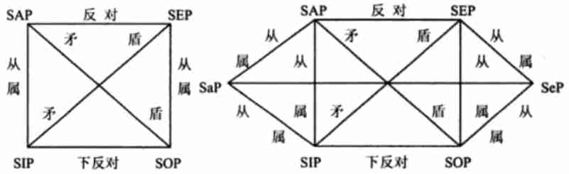

# 直言命题间的真假对当关系

具有相同主项和谓项的直言命题之间，在真假方面存在着必然的制约关系，这种关系就叫做直言命题间的真假对当关系。它包括 **从属关系**、**矛盾关系**、**下反对关系** 和 **反对关系** 四种。

## 1 - 从属关系

从属关系存在于全称肯定命题（SAP）与特称肯定命题（SIP）之间、全称否定命题（SEP）与特称否定命题（SOP）之间。具有从属关系的两个命题之间的关系：全称真则特称真；特称假则全称假。

例如：  
当“我们班所有同学考试都及格了”为真时，“我们班有些同学考试及格了”必然为真  
当“我们班有些同学考试及格了”为假时，“我们班所有同学考试都及格了”必然为假  
当“我们班所有同学考试都及格了”为假时，“我们班有些同学考试及格了”的真假情况不能确定  
当“我们班有些同学考试及格了”为真时，“我们班所有同学考试都及格了”的真假情况不能确定

同时，全称肯定命题（SAP）与单称肯定命题（SaP）之间、单称肯定命题（SaP）与特称肯定命题（SIP）之间、全称否定命题（SEP）与单称否定命题（SeP）之间、单称否定命题（SeP）与特称否定命题（SOP）之间也具有着从属关系。

例如：  
当“我们班所有同学考试都及格了”为真时，“我们班的某个同学考试及格了”必然为真  
当“我们班的某个同学考试及格了”为真时，“我们班有些同学考试及格了”必然为真

〓总结〓

直言命题之间的推出关系：  
① 全称肯定命题 → 单称肯定命题 → 特称肯定命题  
② 全称否定命题 → 单称否定命题 → 特称否定命题  
即，所有 S（不）是 P → 某个 S（不）是 P → 有的 S（不）是 P

## 2 - 矛盾关系

矛盾关系存在于全称肯定命题（SAP）和特称否定命题（SOP）之间、全称否定命题（SEP）和特称肯定命题（SIP）之间、单称肯定命题（SaP）和单称否定命题（SeP）之间。具有矛盾关系的两个命题之间的关系：必有一真一假。

例如：  
“我们班所有同学考试都及格了”与“我们班有些同学考试不及格”之间是矛盾关系  
“我们班所有同学考试都不及格”与“我们班有些同学考试及格了”之间是矛盾关系  
“张永考试及格了”与“张永考试不及格”之间是矛盾关系

## 3 - 下反对关系

下反对关系存在于特称肯定命题（SIP）和特称否定命题（SOP）之间。具有下反对关系的两个命题之间的关系：不能同假（必有一真），但是可以同真。

例如：  
“我们班有些同学考试及格了”与“我们班有些同学考试不及格”之间具有下反对关系

同时，单称否定命题（SeP）与特称肯定命题（SIP）之间、单称肯定命题（SaP）与特称否定命题（SOP）之间也具有下反对关系。

## 4 - 反对关系

反对关系存在于全称肯定命题（SAP）和全称否定命题（SEP）之间。具有反对关系的两个命题之间的关系：不能同真（必有一假），但是可以同假。

例如：  
“我们班所有同学考试都及格了”与“我们班所有同学考试都不及格”之间具有反对关系

同时，全称肯定命题（SAP）与单称否定命题（Sep）之间、全称否定命题（SEP）与单称肯定命题（SaP）之间也具有反对关系。

## 5 - 真假对当关系总结

SAP、SEP、SIP 和 SOP 四种直言命题之间的真假对当关系，可以用一个正方形来表示，这个正方形就叫做“逻辑方阵”。如果再考虑 SaP 和 SeP，“逻辑方阵”可拓广为“六角方阵”。

## 6 - 案例分析

【例 1】一家珠宝店的珠宝被盗，经查可以肯定是甲、乙、丙、丁四人中的某一个人所为。审讯中，他们四人各自说了一句话。  
甲说：“我不是罪犯。”  
乙说：“丁是罪犯。”  
丙说：“乙是罪犯。”  
丁说：“我不是罪犯。”  
经调查证实，四人中只有一个人说的是真话。  
根据以上条件，下列哪个判断为真？  
A. 甲说的是假话，因此，甲是罪犯。  
B. 乙说的是真话，丁是罪犯。  
C. 丙说的是真话，乙是罪犯。  
D. 丁说的是假话，丁是罪犯。  
E. 四个人说的全是假话，丙才是罪犯。

> 解析：  
> 由于乙的话与丁的话是相互矛盾的，根据对当关系中的矛盾关系，二者必有一真，所以四人中惟一说真话的就在乙和丁二人之中。于是，甲和丙所说的话都为假。既然甲的话为假，则说明甲是罪犯。所以，正确选项应该是 A。

【例 2】某珠宝店失窃，甲、乙、丙、丁四人涉嫌被拘审。四人的口供如下：  
甲：案犯是丙。  
乙：丁是罪犯。  
丙：如果我作案，那么丁是主犯。  
丁：作案的不是我。  
四个口供中只有一个是假的。  
如果上述断定为真，那么以下哪项是真的？  
A. 说假话的是甲，作案的是乙。  
B. 说假话的是丁，作案的是丙和丁。  
C. 说假话的是乙，作案的是丙。  
D. 说假话的是丙，作案的是丙。  
E. 说假话的是甲，作案的是甲。

> 解析：  
> 题千中乙的话与丁的话具有互相矛盾关系，二者必有一个是假的，题干中说：四个口供中只有一个是假的，显然，假的命题只能在乙与丁的口供中。于是，甲和丙的话都是真的。由甲和丙的话都为真做前提，可以推出结论：丁是主犯。丁是主犯，当然，丁也就是罪犯，所以，乙的话是真的，丁的话是假的。所以，罪犯是丙和丁，说假话的是丁。正确答案是 B。

【例 3】某仓库失窃，四个保管员涉嫌被传讯。四人的口供如下：  
甲：我们四人都没作案。  
乙：我们中有人作案。  
丙：乙和丁至少有人没作案。  
丁：我没作案。  
如果四人中有两人说的是真话，有两人说的是假话，那么以下哪项断定成立？  
A. 说真话的是甲和丙。  
B. 说真话的是甲和丁。  
C. 说真话的是乙和丙。  
D. 说真话的是乙和丁。  
E. 说真话的是丙和丁。

> 解析：  
> 由于甲和乙的话具有矛盾关系，二者必有一真一假，再根据题干中的己知条件，可知丙和丁的话也必有一真一假。首先考虑丙和丁这两句话，如果丙的话为假，那么意味着乙和丁都作了案，此时丁的话也必为假。这就是说，假设丙的话为假则丁的话也必为假，所以，丙的话不能是假的，丙的话必为真，说假话的是丁，丁是作案者。既然丁作了案，则甲说 “我们四人都没作案”必为假，乙的话为真。因此，乙和丙的话都是真的，甲和丁的话都是假的，正确答案是 C。

【例 4】有人说，哺乳动物都是胎生的。  
以下哪项最能驳斥上述判断？  
A. 也许有的非哺乳动物是胎生的。  
B. 可能有的哺乳动物不是胎生的。  
C. 没有见到过非胎生的哺乳动物。  
D. 非胎生的动物不大可能是哺乳动物。  
E. 鸭嘴兽是哺乳动物，但不是胎生的。

> 解析：  
> 要反驳某一个命题，也就是要确定某一个命题是假的。题干中是一个全称肯定命题，根据对当关系，当一个特称否定命题为真时，相对应的全称肯定命题一定假，所以，需要寻找一个特称否定命题来反驳题干。如果选项 E 为真，那么可以推出一个特称否定命题：有些哺乳动物不是胎生的。选项 C 和 D 都支持题干，A 对题干没有提出质疑，B 项虽能削弱题干（只是“可能”），但是远不如 E 项有力。所以，正确答案是 E。
